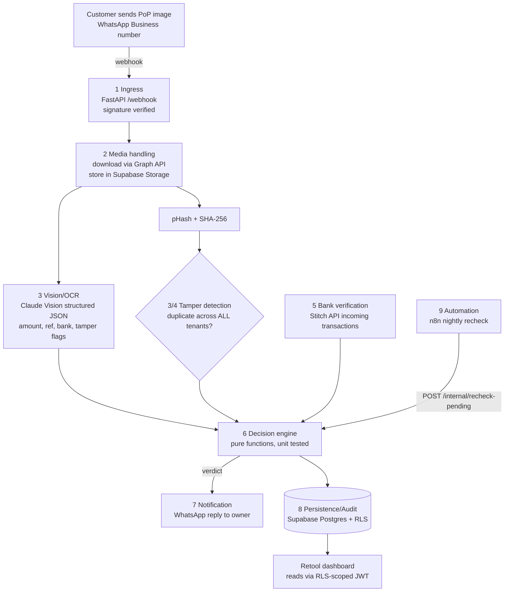

# WhatsApp PoP Fraud Verification ("WhatsApp OS")

Detects fake, edited, or reused proof-of-payment (PoP) screenshots that customers
send to South African SMEs over WhatsApp — before goods are released. A WhatsApp-native
bot receives the screenshot, extracts the claimed payment details with Claude Vision,
cross-checks them against real bank transactions via Stitch, and replies with a verdict
in seconds: **VERIFIED / PENDING / SUSPICIOUS / FAKE**.

This repo contains the Phase 1 MVP. The data model already accommodates Phase 2
(reconciliation, reminders, debtors) — see [TODO.md](TODO.md).

## Architecture



**Verdict logic** (see `app/services/decision_engine.py`):

| Condition | Verdict |
|---|---|
| Image hash seen before (any tenant) | `FAKE` |
| Not a payment proof, or strong tamper flags (edited text, font mismatch) | `SUSPICIOUS` |
| Claim matches a real incoming Stitch transaction (amount + reference/time) | `VERIFIED` |
| Clean image but no bank data / money not reflected yet | `PENDING` → nightly re-check |

## Project layout

```
app/
  main.py               FastAPI app
  config.py             env-driven settings
  logging_config.py     JSON structured logging
  routes/
    webhook.py          WhatsApp webhook (GET verify, POST events)
    internal.py         n8n automation endpoints (shared-secret auth)
  services/
    pipeline.py         orchestrates the 9-step workflow
    vision.py           Claude Vision structured extraction
    decision_engine.py  verdict logic (pure, tested)
    matching.py         PoP claim <-> bank transaction matching (pure, tested)
    hashing.py          perceptual + SHA-256 hashing
    whatsapp.py         Cloud API client + signature verification
    stitch.py           Stitch open-banking client
    db.py               Supabase persistence
  models/schemas.py     Pydantic models (also the Claude structured-output schema)
supabase/schema.sql     all tables + RLS policies + storage bucket
tests/                  decision engine + matching unit tests
```

## Setup

### 1. Prerequisites

- Python 3.11+
- A Supabase project
- A Meta App with WhatsApp Business platform access (phone number ID + permanent token)
- An Anthropic API key
- Stitch client credentials (optional for local dev — without them all verdicts degrade to `PENDING`)

### 2. Database

Apply `supabase/schema.sql`, then the files in `supabase/migrations/` in order,
in the Supabase SQL editor (or `supabase db push`). Then register a tenant:

```sql
insert into businesses (name, whatsapp_phone_number_id, owner_whatsapp_number, pricing_tier)
values ('Acme Wholesale', '<META_PHONE_NUMBER_ID>', '27821234567', 'growth');
```

### 3. Run locally

```bash
python -m venv .venv && source .venv/bin/activate
pip install -r requirements.txt
cp .env.example .env   # fill in values
uvicorn app.main:app --reload
```

Expose the webhook with a tunnel (e.g. `ngrok http 8000`) and register
`https://<tunnel>/webhook` in the Meta App dashboard using `WHATSAPP_VERIFY_TOKEN`.

### 4. Tests

```bash
pytest
```

### 5. Docker

```bash
docker build -t pop-verify .
docker run --env-file .env -p 8000:8000 pop-verify
```

### 6. n8n automation workflows

All internal endpoints require the `X-Internal-Api-Key: $INTERNAL_API_KEY` header.
Create two n8n workflows (self-hosted on Railway), each a Cron node + HTTP Request node:

| Workflow | Schedule | Endpoint | What it does |
|---|---|---|---|
| Nightly reconciliation | daily 02:00 SAST | `POST /internal/reconcile` | Syncs Stitch transactions for every linked business, matches them against open submissions, flips confirmed `PENDING`s to `VERIFIED`, settles paid reminders, and WhatsApps the owner a digest of unmatched money / unmatched claims |
| Payment reminders | daily 09:00 SAST | `POST /internal/send-reminders` | Scans `reminder_schedule` and sends WhatsApp reminders to customers (first on due date, follow-ups every `REMINDER_CADENCE_DAYS`, capped at `REMINDER_MAX_SENDS`) |

`POST /internal/recheck-pending` is still available for ad-hoc re-checks of the
pending queue only.

## Environment variables

See [.env.example](.env.example) for the full annotated list: WhatsApp Cloud API
(verify token, app secret, access token), Anthropic, Stitch, Supabase
(service-role key), the n8n shared secret, and decision-engine tuning knobs.
All secrets come from the environment — nothing is hardcoded.

## Multi-tenancy & security

- Webhook signature verification (`X-Hub-Signature-256`) is mandatory; unsigned
  requests are rejected.
- RLS is enabled on every table. Tenants (Retool, future APIs) authenticate with
  a JWT carrying `business_id`; the backend uses the service-role key because the
  duplicate-image check is deliberately **cross-tenant** (a screenshot reused at
  another business is the strongest fraud signal).
- Customer phone numbers are stored hashed on `pop_submissions`; the per-tenant
  `customers` table holds the real number for Phase 2 reminders.
- Usage is metered per business per month in `usage_counters`; tier limits are a
  column on `businesses`, ready for enforcement when billing (PayFast) lands.

## Phase 2 — Reconciliation, reminders & debtors (built)

- **Reconciliation** (`app/services/reconciliation.py`): nightly, every synced
  Stitch transaction is matched 1:1 against open submissions (a deposit settles
  at most one claim, oldest first). Matches flip to `VERIFIED`, settle the
  customer's open reminders, and the owner gets a WhatsApp digest of money with
  no matching PoP and PoPs with no matching money.
- **Reminders** (`app/services/reminders.py`): `reminder_schedule` rows (created
  by the owner in Retool) drive WhatsApp reminders to customers — first on the
  due date, follow-ups on a cadence, capped. Reminders invite the customer to
  reply with a PoP, which feeds straight back into the verification core.
- **Debtor management**: Retool reads the `v_debtors` view — per-customer
  outstanding balance with aging buckets (current / 30 / 60 / 90 / 90+) —
  plus `v_unreconciled_transactions` and `v_unmatched_submissions`. All three
  views use `security_invoker` so tenant RLS applies.
- Also landed with Phase 2: webhook idempotency (unique index on
  `whatsapp_message_id` + early return) and tier enforcement (submissions past
  the monthly limit are rejected with an upgrade nudge to the owner).

## Phase 3 — WhatsApp order management (built)

A distinct module (`app/services/orders.py`, `app/services/order_chat.py`) that
integrates with — but doesn't replace — the verification core. Text messages on
the business number are now handled:

**Customers** can text:
- `catalog` / `menu` — product list with prices
- `order 2x white bread, 1x milk` — places an order; the reply includes the
  total, the owner's payment details, and the order number to use as the
  payment reference
- `status ORD-12` — order status
- Free text ("can I get two loaves please") falls back to Claude structured
  parsing against the catalog

**Owners** (messages from the configured owner number) can text:
- `add product <name> <price>` · `orders` · `fulfil ORD-12` · `cancel ORD-12`

**The loop closes through verification:** customers are told to pay with the
order number as reference, so when their PoP screenshot is verified (live or by
nightly reconciliation), the matching open order is automatically marked
`paid`, linked to the submission, and the owner's verdict message includes
"Order ORD-12 marked as paid". Order statuses: `pending_payment → paid →
fulfilled` (cancellable until fulfilled).

## How Phase 4 builds on this schema

- **Phase 4 — Invoicing & reporting:** invoices hang off `orders` /
  `order_items` / `customers` (quantities and prices are already denormalised
  per line); `verification_log` + `usage_counters` + `orders` feed the
  revenue, fraud-rate and volume reporting in Retool.
